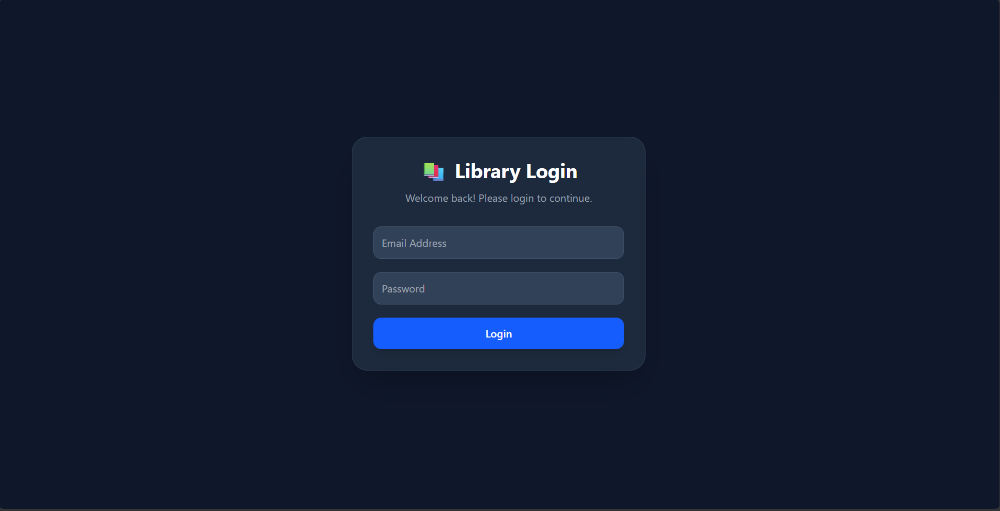
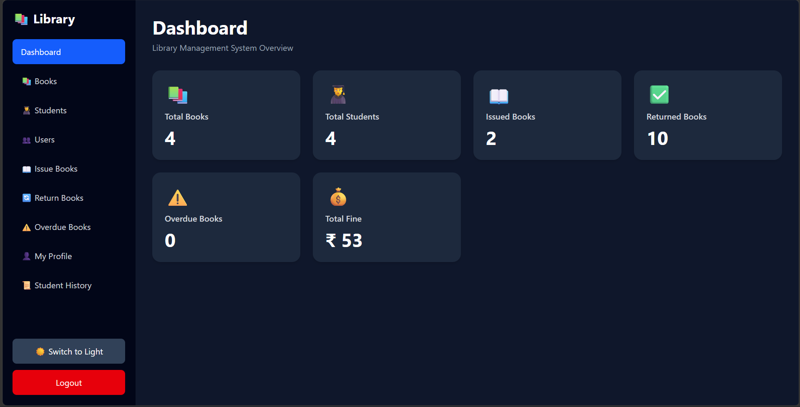
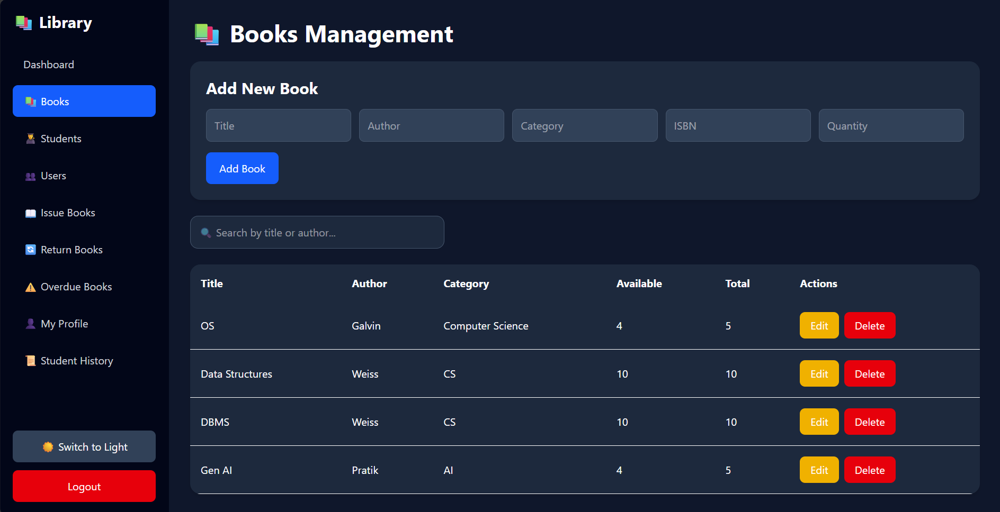
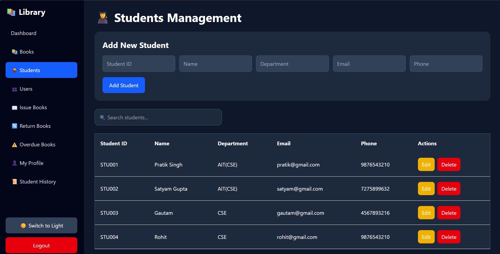
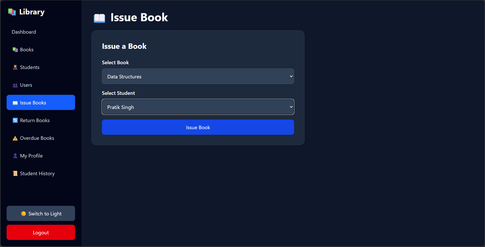
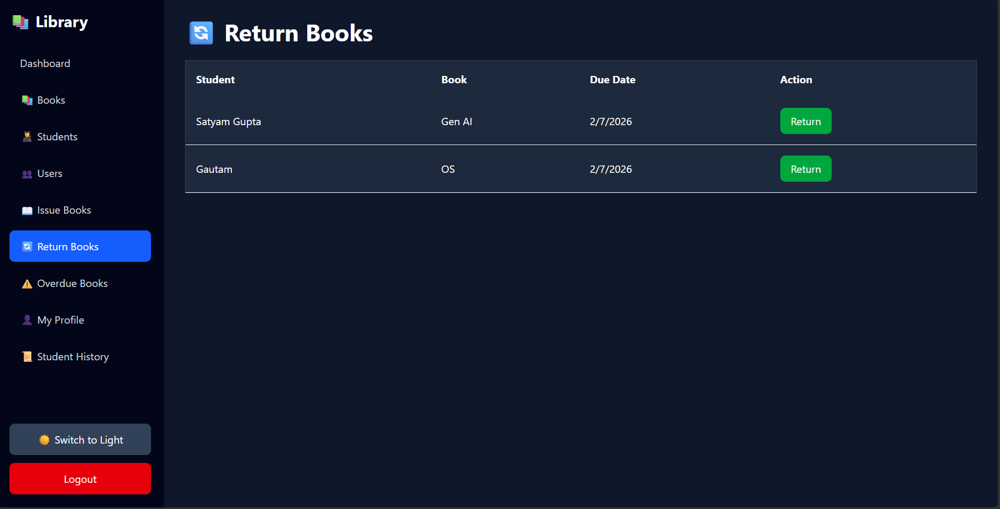
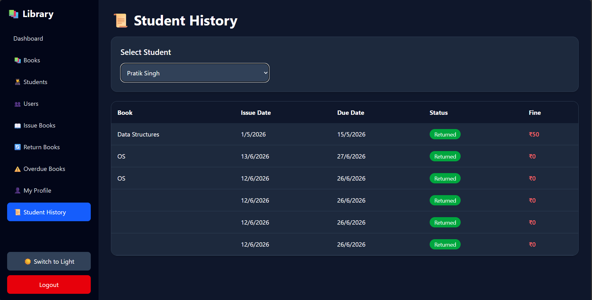

# 📚 Library Management System

A Full Stack Library Management System built using the MERN Stack (MongoDB, Express.js, React.js, Node.js). The system provides secure authentication, role-based access control, book and student management, issue/return tracking, fine calculation, overdue monitoring, and dashboard analytics.

---

## 🚀 Features

### Authentication & Security

* JWT Authentication
* Protected Routes
* Role-Based Authorization (Admin / Student)
* Change Password
* Self-Delete Protection
* Secure Backend APIs

### User Management

* Create Users
* View Users
* Delete Users
* Admin-Only Access Control

### Student Management

* Add Student
* Update Student
* Delete Student
* Search Student

### Book Management

* Add Book
* Update Book
* Delete Book
* Search Books
* View Book Details

### Library Operations

* Issue Books
* Return Books
* Due Date Tracking
* Overdue Book Detection
* Fine Calculation

### Dashboard

#### Admin Dashboard

* Total Books
* Total Students
* Issued Books
* Returned Books
* Overdue Books
* Total Fine

#### Student Dashboard

* Available Books
* My Issued Books
* My Pending Fine
* My Due Books

### Additional Features

* Student Borrowing History
* Dark / Light Mode
* Responsive UI
* Toast Notifications

---

## 🛠️ Tech Stack

### Frontend

* React.js
* React Router DOM
* Tailwind CSS
* Axios
* React Hot Toast

### Backend

* Node.js
* Express.js

### Database

* MongoDB
* Mongoose

### Authentication

* JWT (JSON Web Token)
* bcryptjs

---

## 📂 Project Structure

```text
Library_Management_FS
│
├── backend
│   ├── controllers
│   ├── middleware
│   ├── models
│   ├── routes
│   ├── config
│   └── server.js
│
├── frontend
│   ├── src
│   │   ├── components
│   │   ├── context
│   │   ├── pages
│   │   └── api
│   └── public
│
└── README.md
```

---

## ⚙️ Installation

### Clone Repository

```bash
git clone https://github.com/Sinpratik56/LibraryManagement.git
cd LibraryManagement
```

### Backend Setup

```bash
cd backend
npm install
```

Create a `.env` file:

```env
PORT=5000
MONGO_URI=your_mongodb_connection_string
JWT_SECRET=your_secret_key
```

Start Backend:

```bash
npm run dev
```

### Frontend Setup

```bash
cd frontend
npm install
npm run dev
```

---

## 🔐 Roles

### Admin

* Manage Books
* Manage Students
* Manage Users
* Issue Books
* Return Books
* View Dashboard Analytics

### Student

* View Books
* View Personal Dashboard
* View Borrowing History
* Change Password

---

## 📸 Screenshots

Add screenshots of:

* 
* 
* Student Dashboard
* 
* 
* User Management
* 
* 
* 

---

## 📈 Future Enhancements

* Email Notifications
* Book Cover Upload
* PDF Report Export
* Dashboard Charts
* Advanced Search Filters

---

## 👨‍💻 Author

**Pratik Singh**

GitHub: https://github.com/Sinpratik56

---

## 📄 License

This project is developed for educational and learning purposes.
